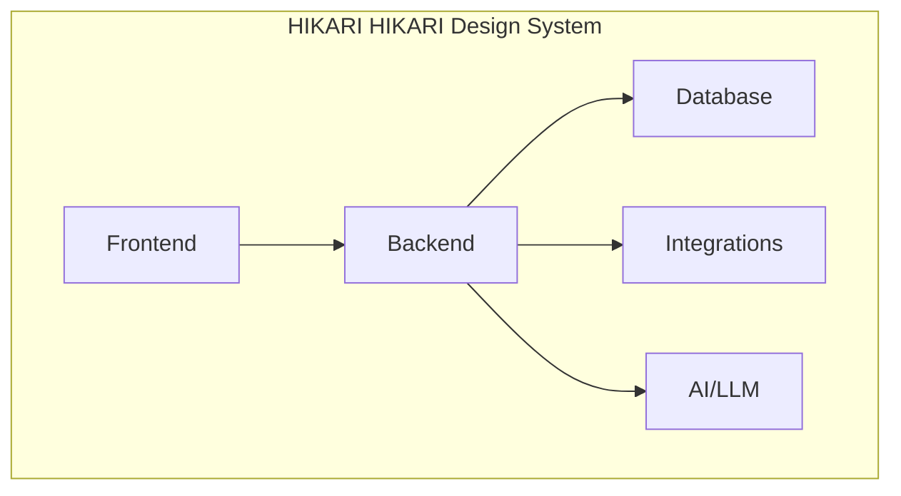

<div align="center">

# 🏔️ HIKARI Design System

**Système de design React + Tailwind CSS pour applications PropTech**

[](./LICENSE) [](https://react.dev/) [](https://www.typescriptlang.org/) [](https://tailwindcss.com/) []() []()
[](./CHANGELOG.md)
[](./CONTRIBUTING.md)
[](https://github.com/HIKARI-GROUP/hikari-design-system)
[](https://github.com/HIKARI-GROUP/hikari-design-system/commits)
[](https://github.com/HIKARI-GROUP/hikari-design-system/discussions)

[📖 Documentation](./docs/) · [🗺️ Roadmap](./ROADMAP.md) · [🤝 Contributing](./CONTRIBUTING.md) · [💻 Examples](./examples/) · [🧪 Tests](./tests/) · [🤖 AI](./ai/) · [💼 Careers](./CAREERS.md)

</div>

---

## 📋 Overview

A comprehensive React + Tailwind CSS design system for PropTech and real estate applications. Dark-mode native, token-based, fully responsive.

## ✨ Features

- 🎨 Design tokens (colors, typography, spacing)
- 🌙 Dark mode native
- 📱 Fully responsive (mobile + desktop)
- ♿ Accessibility (WCAG AA)
- 🧩 20+ reusable components
- 📊 Data visualization with Recharts
- 🎭 Animations with Framer Motion

## 🏗️ Architecture



See [Architecture](./docs/Architecture.md) for full details.

## 🚀 Installation

```bash
npm install @hikari/design-system
```

## 📖 Usage

```javascript
import { StatCard, Badge, Button } from "@hikari/design-system";

<StatCard label="Rentabilité" value="7.2%" color="#34d399" />
```

## 📁 Project Structure

```
hikari-design-system/
├── src/
│   ├── components/     # UI components
│   ├── tokens/        # Design tokens
│   └── index.css       # Token definitions
├── docs/
├── examples/
├── tests/
└── .storybook/
```

## 🛠️ Technologies

- React 18
- TypeScript
- Tailwind CSS 3
- Framer Motion
- Lucide Icons

## 📚 Documentation

| Document | Description |
|---|---|
| [Architecture](./docs/Architecture.md) | System architecture and design decisions |
| [Backend](./docs/Backend.md) | Backend services and API |
| [Frontend](./docs/Frontend.md) | Frontend architecture |
| [Database](./docs/Database.md) | Database schema and operations |
| [API](./docs/API.md) | API conventions |
| [Authentication](./docs/Authentication.md) | Auth flows |
| [Security](./docs/Security.md) | Security practices |
| [Deployment](./docs/Deployment.md) | Deployment guide |
| [Coding Standards](./docs/Coding-Standards.md) | Code conventions |
| [Testing](./docs/Testing.md) | Testing guide |
| [CI-CD](./docs/CI-CD.md) | CI/CD pipeline |
| [Git Workflow](./docs/Git-Workflow.md) | Branching & PR process |
| [Onboarding](./docs/Developer-Onboarding.md) | Developer onboarding |
| [Environment](./docs/Environment.md) | Environment setup |

## 🗺️ Roadmap

See [ROADMAP.md](./ROADMAP.md) for our full vision.

## 🤝 Contributing

We welcome contributions! Please read [CONTRIBUTING.md](./CONTRIBUTING.md) first.

- 🐛 [Report a bug](https://github.com/HIKARI-GROUP/hikari-design-system/issues/new?labels=bug)
- 💡 [Request a feature](https://github.com/HIKARI-GROUP/hikari-design-system/issues/new?labels=enhancement)
- 📝 [Improve docs](https://github.com/HIKARI-GROUP/hikari-design-system/issues/new?labels=documentation)
- 🔍 [Good first issues](https://github.com/HIKARI-GROUP/hikari-design-system/labels/good%20first%20issue)

## 📄 License

MIT © HIKARI GROUP

## 💼 Careers

We're hiring! See [CAREERS.md](./CAREERS.md) for open positions.

## 🌐 Links

- 🏢 [HIKARI GROUP](https://github.com/HIKARI-GROUP)
- 🌍 [Website](https://hikari-group.tech)
- 💼 [LinkedIn](https://www.linkedin.com/company/hikari-group)
- 📧 [Contact](mailto:contact@hikari-group.tech)

---

<div align="center">
  <sub>Built with ❤️ by <a href="https://github.com/HIKARI-GROUP">HIKARI GROUP</a></sub>
</div>
